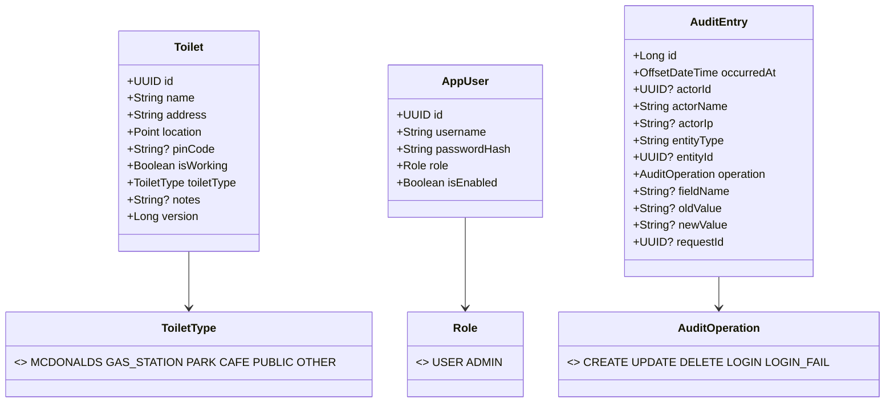
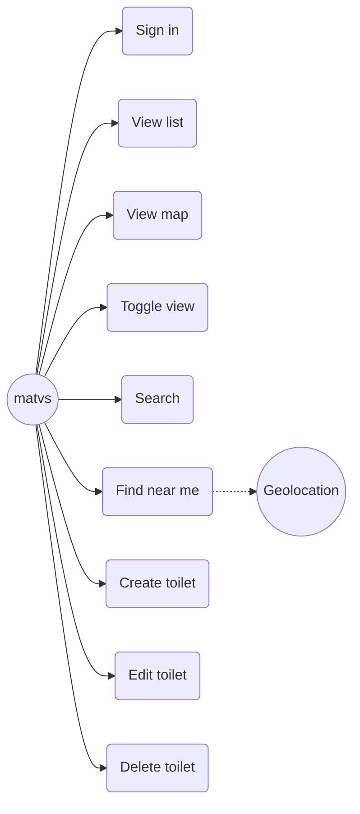
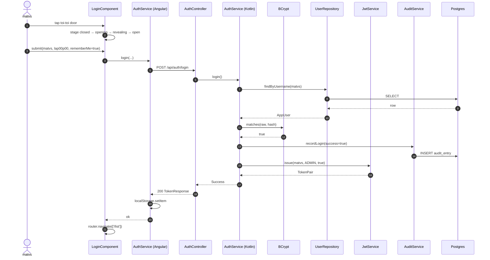
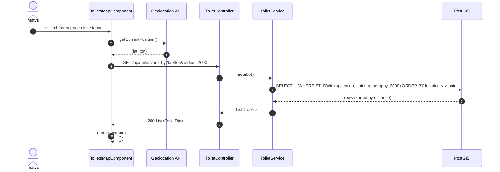
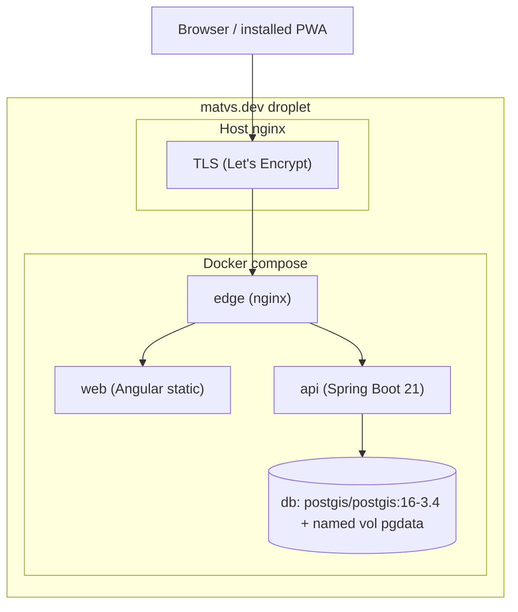
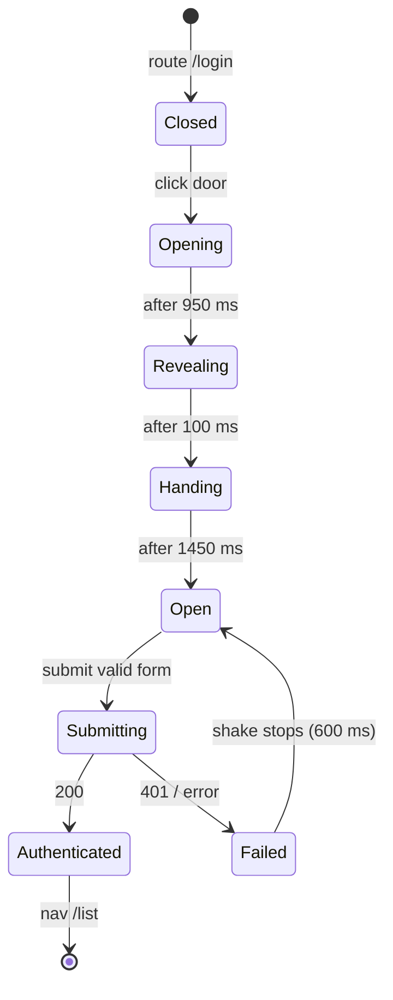

# freepeepee – architecture

## Stack at a glance

| Layer | Tech | Notes |
|---|---|---|
| Frontend | Angular 18 (standalone), Angular Material, Leaflet, SCSS, Pug (via `@webdiscus/pug-loader`), Service Worker (`@angular/service-worker`) | PWA installable, works offline for previously-loaded tiles and toilet list. |
| Backend  | Spring Boot 3.3, Kotlin 1.9 (`-Xcontext-receivers`), Spring Security, Spring Data JPA, Hibernate Spatial 6.5, JJWT 0.12, Flyway 10. | Stateless API, BCrypt cost 12, JWT only. |
| Database | PostgreSQL 16 + PostGIS 3.4 | Relational + geospatial. Audit log append-only (DB trigger). |
| Maps     | OpenStreetMap raster tiles, Leaflet 1.9 | No Google Maps; OSM is free, attribution required. |
| Edge     | nginx 1.27-alpine (compose), host nginx for TLS | TLS terminated on host, plain HTTP into compose on `127.0.0.1:8081`. |
| CI/CD    | GitHub Actions, GHCR, Trivy | Build, test, coverage gate (≥75 %), SBOM image scan. |

## Why PostgreSQL + PostGIS over MongoDB

1. **Audit log integrity** – append-only requires transactional INSERTs with a DB-level trigger guard. Mongo's transaction story is workable but not native.
2. **Geospatial queries** – `ST_DWithin` over a GIST index is the canonical answer for "within N metres". Mongo's `$geoWithin` works but PostGIS is more powerful (KNN ordering via `<->` operator, geography vs geometry distinction).
3. **Schema stability** – the toilet entity has fixed shape; document flexibility buys nothing.
4. **One process to host** – one container, one backup pipeline. Less to harden.

## Domain shape



## Use cases



## Login sequence



## Find-near-me sequence



## Activity – edit toilet (with audit diff)

```mermaid
flowchart TD
    A([User opens edit dialog]) --> B[Form pre-fills with current values + version]
    B --> C[User edits and submits]
    C --> D{Form valid?}
    D -- no --> E[Show inline validation] --> Z([end])
    D -- yes --> F[PUT /api/toilets/&#123;id&#125;]
    F --> G[JwtAuthFilter verifies token]
    G --> H{Entity exists?}
    H -- no --> I[404] --> Z
    H -- yes --> J{Version matches?}
    J -- no --> K[409 conflict] --> Z
    J -- yes --> L[Snapshot BEFORE]
    L --> M[Apply changes, JPA save]
    M --> N[Snapshot AFTER]
    N --> O[Diff via Kotlin reflection]
    O --> P[INSERT one AuditEntry per changed field]
    O --> Q[200 with updated DTO]
```



## Component view

```mermaid
flowchart LR
    U((User)) -->|HTTPS| HN[Host nginx<br/>TLS]
    HN -->|127.0.0.1:8081| EN[Edge nginx<br/>compose]
    EN -->|static| WEB[Angular SPA]
    EN -->|/api/**| API[Spring Boot]
    API --> DB[(PostgreSQL + PostGIS)]
    WEB -.tile.openstreetmap.org.-> OSM[(OSM tiles)]
    WEB --- SW[Service Worker]
```

## Deployment



## Login state machine



## Security model

- **Passwords** : BCrypt (cost 12). Hash only persisted; raw never logged. Rotate cost upward as hardware improves.
- **Sessions** : none. Stateless JWT (HS512, ≥64-byte secret, configured via env). Short-lived access token (30 min default), optional 14-day refresh issued only on `rememberMe=true`.
- **Transport** : TLS terminated by host nginx. Backend trusts `X-Forwarded-Proto`, `X-Forwarded-For`, `X-Request-Id` headers from the edge it sits behind.
- **Headers** : `X-Content-Type-Options nosniff`, `X-Frame-Options DENY`, CSP `default-src 'self'`, `Permissions-Policy geolocation=(self)`.
- **Audit log** : append-only at the DB level via trigger. Even an authenticated admin cannot rewrite history through the API.
- **CSRF** : N/A (no cookies; bearer token only).
- **Rate limit** : not implemented in this scaffold. Add at edge nginx (`limit_req_zone`) on `/api/auth/login` before production.

## Patterns at use

- **Sealed result types** (`AuthResult`, `ToiletOpResult`) – controllers map exhaustively, eliminating un-handled error paths at compile time.
- **Optimistic locking** on `Toilet.version` – clients pass the version they edited, server returns 409 on conflict.
- **Repository / Service / Controller** – classical layered separation; controllers are thin and contain no business logic.
- **Strategy via enum** – `ToiletType` is a closed set, persisted as a Postgres ENUM with Hibernate `NAMED_ENUM`.
- **Observer-ish audit** – every mutating service call records to the audit log inside the same transaction.
- **HTTP interceptors** (frontend) – `authInterceptor` attaches the bearer token; `errorInterceptor` reacts to 401 by signing out.
- **Standalone components + signals** (Angular 18) – no NgModules, zoneless-ready signals for state.
