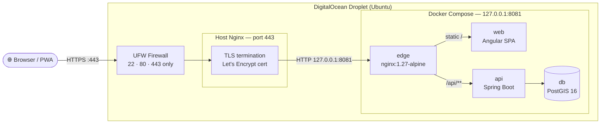
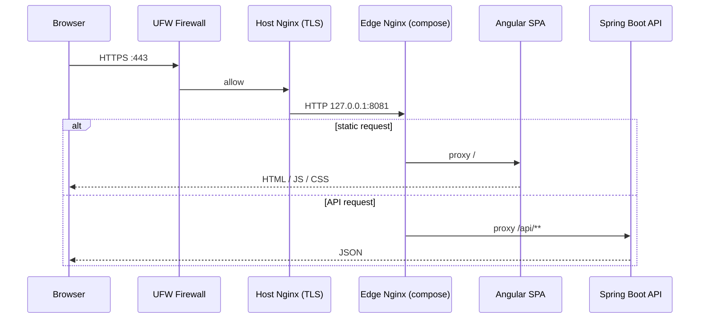
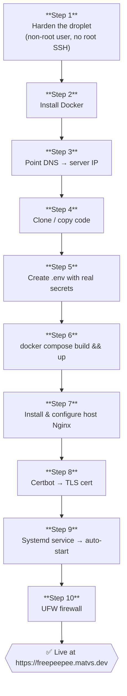
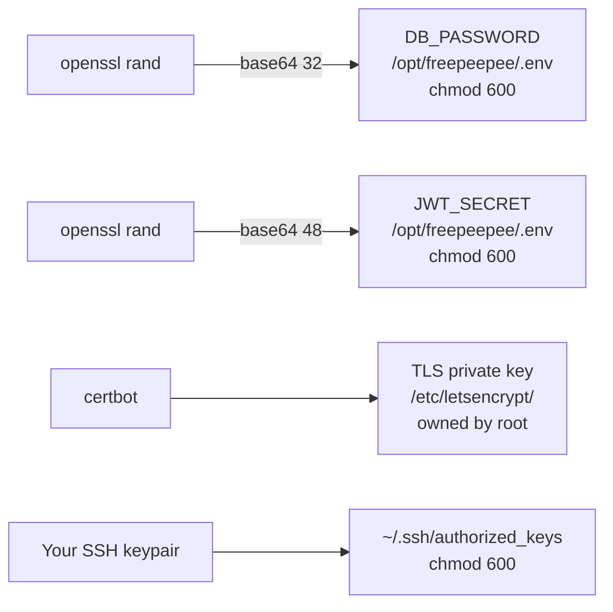
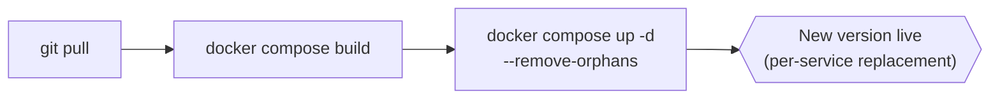
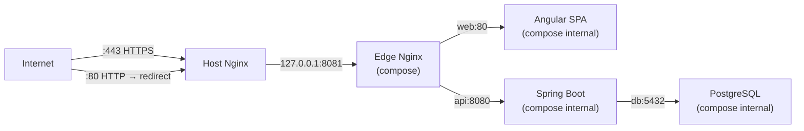

# Production Deployment Guide

> **Stack:** Angular SPA · Spring Boot API · PostgreSQL/PostGIS · Docker Compose · Nginx · Let's Encrypt  
> **Target:** Single Ubuntu droplet on DigitalOcean — no Kubernetes needed.

---

## Architecture at a Glance



---

## Traffic Flow



---

## Deploy Steps Overview



---

## Step 1 — Harden the Droplet

SSH in as `root` for the first and last time:

```bash
ssh root@YOUR_SERVER_IP
```

Create a non-root deploy user and lock down SSH:

```bash
adduser deploy
usermod -aG sudo deploy

# Copy your SSH key to the new user
rsync --archive --chown=deploy:deploy ~/.ssh /home/deploy

# Disable root login over SSH
sed -i 's/^PermitRootLogin yes/PermitRootLogin no/' /etc/ssh/sshd_config
systemctl reload ssh
```

> **From now on** all commands run as `deploy`:
> ```bash
> ssh deploy@YOUR_SERVER_IP
> ```

---

## Step 2 — Install Docker

```bash
sudo apt update && sudo apt upgrade -y
sudo apt install -y ca-certificates curl gnupg

sudo install -m 0755 -d /etc/apt/keyrings
curl -fsSL https://download.docker.com/linux/ubuntu/gpg \
  | sudo gpg --dearmor -o /etc/apt/keyrings/docker.gpg

echo "deb [arch=$(dpkg --print-architecture) signed-by=/etc/apt/keyrings/docker.gpg] \
  https://download.docker.com/linux/ubuntu $(. /etc/os-release && echo "$VERSION_CODENAME") stable" \
  | sudo tee /etc/apt/sources.list.d/docker.list

sudo apt update
sudo apt install -y docker-ce docker-ce-cli containerd.io docker-compose-plugin

# Let deploy run docker without sudo
sudo usermod -aG docker deploy

# Re-login so the group takes effect
exit && ssh deploy@YOUR_SERVER_IP
```

---

## Step 3 — Point DNS to the Server

In your DNS provider, add an **A record**:

| Name | Type | Value |
|---|---|---|
| `freepeepee.matvs.dev` | A | `YOUR_SERVER_IP` |

Wait for propagation, then verify:

```bash
dig +short freepeepee.matvs.dev
# must return YOUR_SERVER_IP before continuing
```

---

## Step 4 — Get the Code onto the Server

**Option A — git clone** *(recommended)*

```bash
sudo mkdir -p /opt/freepeepee
sudo chown deploy:deploy /opt/freepeepee
cd /opt/freepeepee
git clone YOUR_REPO_URL .
```

**Option B — rsync from local machine** *(if no remote repo yet)*

```bash
# Run this from your LOCAL machine
rsync -avz \
  --exclude='.env' \
  --exclude='node_modules' \
  --exclude='.gradle' \
  /home/matvs/projects/freepeepee/ \
  deploy@YOUR_SERVER_IP:/opt/freepeepee/
```

---

## Step 5 — Create the `.env` File with Real Secrets

> **Never** copy your local `.env` to the server. Always generate fresh values.

```bash
cd /opt/freepeepee

# Generate cryptographically strong secrets
DB_PASS=$(openssl rand -base64 32)
JWT=$(openssl rand -base64 48)

cat > .env <<EOF
VERSION=v0.1.0

DB_USER=freepeepee
DB_PASSWORD=${DB_PASS}

# Must be >= 32 bytes; JJWT rejects shorter keys
JWT_SECRET=${JWT}

CORS_ORIGINS=https://freepeepee.matvs.dev
EOF

# Only the deploy user may read this file
chmod 600 .env
```

Verify:

```bash
cat .env   # read once, confirm it looks right
ls -la .env
# -rw------- 1 deploy deploy ...
```

### Secret ownership at a glance



---

## Step 6 — Build and Start the App

```bash
cd /opt/freepeepee
docker compose build
docker compose up -d
```

Watch the logs until everything is healthy:

```bash
docker compose ps          # all services should show "running"
docker compose logs -f     # Ctrl+C to exit
```

Smoke-test the internal port:

```bash
curl -s http://127.0.0.1:8081/actuator/health
# {"status":"UP"}
```

---

## Step 7 — Install and Configure Host Nginx

```bash
sudo apt install -y nginx

# Use the config already in the repo
sudo cp /opt/freepeepee/nginx/host-vhost.example.conf \
        /etc/nginx/sites-available/freepeepee.matvs.dev

sudo ln -s /etc/nginx/sites-available/freepeepee.matvs.dev \
           /etc/nginx/sites-enabled/

# Remove the default placeholder
sudo rm -f /etc/nginx/sites-enabled/default

sudo nginx -t                  # must print "test is successful"
sudo systemctl reload nginx
```

---

## Step 8 — TLS Certificate (Let's Encrypt)

```bash
sudo apt install -y certbot python3-certbot-nginx

sudo certbot --nginx \
  -d freepeepee.matvs.dev \
  --non-interactive \
  --agree-tos \
  -m swiatek7@gmail.com
```

Certbot automatically edits your nginx config to add SSL and the HTTP→HTTPS redirect.

Test auto-renewal (runs via cron twice daily after install):

```bash
sudo certbot renew --dry-run
# "Congratulations, all simulated renewals succeeded"
```

---

## Step 9 — Systemd Service (Auto-start on Reboot)

```bash
sudo tee /etc/systemd/system/freepeepee.service > /dev/null <<'EOF'
[Unit]
Description=Freepeepee Docker Compose stack
Requires=docker.service
After=docker.service network-online.target

[Service]
Type=oneshot
RemainAfterExit=yes
WorkingDirectory=/opt/freepeepee
ExecStart=/usr/bin/docker compose up -d --remove-orphans
ExecStop=/usr/bin/docker compose down
TimeoutStartSec=300
User=deploy

[Install]
WantedBy=multi-user.target
EOF

sudo systemctl daemon-reload
sudo systemctl enable freepeepee
sudo systemctl start freepeepee
```

---

## Step 10 — Firewall (UFW)

```bash
sudo ufw allow OpenSSH        # port 22
sudo ufw allow 'Nginx Full'   # ports 80 + 443
sudo ufw --force enable
sudo ufw status
```

Expected output:

```
Status: active

To                         Action      From
--                         ------      ----
OpenSSH                    ALLOW       Anywhere
Nginx Full                 ALLOW       Anywhere
```

> Port `8081` (the Docker edge nginx) is **not** opened — it is bound to `127.0.0.1` only and reachable only via the host nginx proxy.

---

## Step 11 — Verify End-to-End

```bash
# TLS handshake + HSTS header
curl -sI https://freepeepee.matvs.dev | grep -E "HTTP|Strict"

# API health through the full stack
curl -s https://freepeepee.matvs.dev/actuator/health
# {"status":"UP"}
```

Open `https://freepeepee.matvs.dev` in a browser — you should see a padlock and the app.

---

## Updating the App



```bash
cd /opt/freepeepee
git pull
docker compose build
docker compose up -d --remove-orphans
```

Each service is replaced one at a time — Postgres data is never touched.

---

## Secrets Reference

| Secret | Location | How to regenerate | Rotation |
|---|---|---|---|
| `DB_PASSWORD` | `/opt/freepeepee/.env` (chmod 600) | `openssl rand -base64 32` | Manually; requires compose restart |
| `JWT_SECRET` | `/opt/freepeepee/.env` (chmod 600) | `openssl rand -base64 48` | Invalidates all active sessions |
| TLS certificate | `/etc/letsencrypt/` (root-owned) | `certbot renew` | Auto every ~60 days |
| SSH private key | Your local machine only | Generate new keypair, update `authorized_keys` | Whenever a key is compromised |

---

## Troubleshooting

| Symptom | Where to look | Fix |
|---|---|---|
| `502 Bad Gateway` | `docker compose ps` | One container is unhealthy — check `docker compose logs api` |
| `curl 127.0.0.1:8081` times out | `docker compose ps edge` | Edge container not running — `docker compose up -d edge` |
| TLS cert expired | `sudo certbot certificates` | `sudo certbot renew` |
| App doesn't start after reboot | `systemctl status freepeepee` | Check `journalctl -u freepeepee` |
| `DB_PASSWORD:?required` error | `.env` missing or not in `/opt/freepeepee` | Re-create `.env` per Step 5 |
| CORS error in browser | Check `CORS_ORIGINS` in `.env` | Must match the exact `https://` domain the browser sees |

---

## Port Map



| Port | Exposed to | Service |
|---|---|---|
| `443` | Internet | Host Nginx (TLS) |
| `80` | Internet | Host Nginx (redirects to 443) |
| `8081` | localhost only | Docker edge nginx |
| `8080` | compose network only | Spring Boot API |
| `5432` | compose network only | PostgreSQL |

---

*See [architecture.md](architecture.md) for domain model, security model, and sequence diagrams.*
